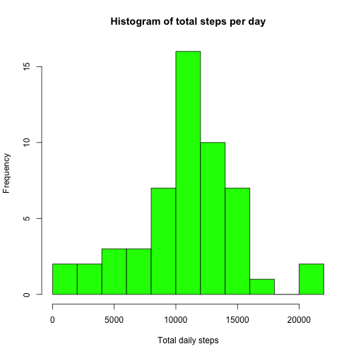
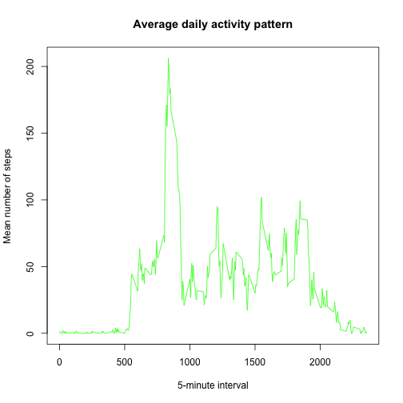
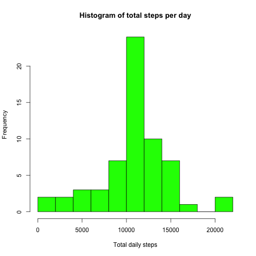

## Loading and preprocessing the data

We can load the data using `read.csv`. To save space, we will use an `unz()` connection to allow `read.csv` to work directly with the zip file, instead of extracting the CSV file and reading it in separate steps.


```r
con <- unz('activity.zip', filename='activity.csv')
d <- read.csv(con, colClasses=c('numeric','Date','numeric'))
```

## What is mean total number of steps taken per day?

To characterize the distribition of daily step counts, we will use `aggregate()` to calculate the total steps per day. Then we'll look at a histogram and the mean and median.


```r
dailyStepHist <- function(d) {
	byDay <- aggregate(steps ~ date, d, sum)
	hist(byDay$steps, breaks = 10, col = "green",
			 main = "Histogram of total steps per day",
			 xlab = "Total daily steps"  )
	meanDailySteps <- mean(byDay$steps)
	medianDailySteps <- median(byDay$steps)
	sprintf('Daily steps: mean = %s  median = %s', meanDailySteps, medianDailySteps)
}

dailyStepHist(d)
```

 

```
## [1] "Daily steps: mean = 10766.1886792453  median = 10765"
```

We see a mean of 10,766 steps, and a median of 10,765 steps.


## What is the average daily activity pattern?

To examine the average daily activity pattern, we will aggregate the steps the other way, grouping them in to the 5-minute time intervals and averaging across all days.


```r
t <- aggregate(steps ~ interval, d, mean)
plot(t$interval, t$steps, type = "l",
		 main = "Average daily activity pattern",
		 col = "green",
		 xlab = "5-minute interval", ylab = "Mean number of steps")
```

 

The interval with the highest average steps is the interval starting at 8:35 AM, with a mean of 206 steps.


```r
ixMax <- which.max(t$steps)
maxInterval <- t$interval[ixMax]
sprintf('Highest average steps: %.1f at interval %s (index %s)',
				t$steps[ixMax], maxInterval, ixMax)
```

```
## [1] "Highest average steps: 206.2 at interval 835 (index 104)"
```


## Imputing missing values

In this data set, 2,304 intervals (out of a total 17,568) have missing data for the number of steps.


```r
nMissing <- sum(is.na(d$steps))
sprintf('%d out of %d records have missing data', nMissing, nrow(d))
```

```
## [1] "2304 out of 17568 records have missing data"
```

We'll use the simple approach of filling in missing data using the mean number of steps for that interval, computing the mean by averaging the step count for that interval across all days that have values present. (Ignoring missing values is the default behavior for the `mean()` function.)


```r
byInt <- aggregate(steps ~ interval, d, mean)
names(byInt)[2] <- 'meanSteps'
d2 <- merge(d, byInt, by = "interval")
tf <- is.na(d2$steps)
d2$steps[tf] <- d2$meanSteps[tf]
```

Our `d2` now contains the same data as the input data set, but with missing step values filled in. We'll redo the daily step count distribution analysis to see what effect filling in the missing values had.


```r
dailyStepHist(d2)
```

 

```
## [1] "Daily steps: mean = 10766.1886792453  median = 10766.1886792453"
```

With missing values filled in, the median step count increased from 10765 to 10766.2, and the mean stayed unchanged at 10766.2. There's no apparent change in the histogram.


## Are there differences in activity patterns between weekdays and weekends?

We'll break the data set in to weekdays and weekends to see how their typical activity differs.


```r
weekday <- weekdays(d2$date)
isweekend <- (weekday == 'Sunday' | weekday =='Saturday')
d2$weekday <- factor(isweekend, labels = c('weekday', 'weekend'))

# Hackish method of doing multi-column grouping
lvl <- levels(d2$weekday)
tmpA <- aggregate(steps ~ interval, d2[d2$weekday == 'weekday',], mean)
tmpA$weekday <- lvl[1]
tmpB <- aggregate(steps ~ interval, d2[d2$weekday == 'weekend',], mean)
tmpB$weekday <- lvl[2]
d3 <- rbind(tmpA, tmpB)
```


```r
library(lattice)
with(d3, xyplot( steps ~ interval | weekday, type = 'l', layout = c(1, 2)))
```

 

We can see that the weekend and weekday activity patterns do differ. The overall activity level on the weekdays is lower than on the weekends, but with a spike of activity around 8:00 AM. This seems intuitively consistent with what an office worker with a "9 to 5" job might experience.

